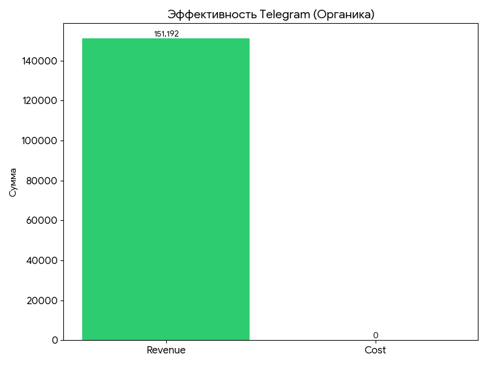
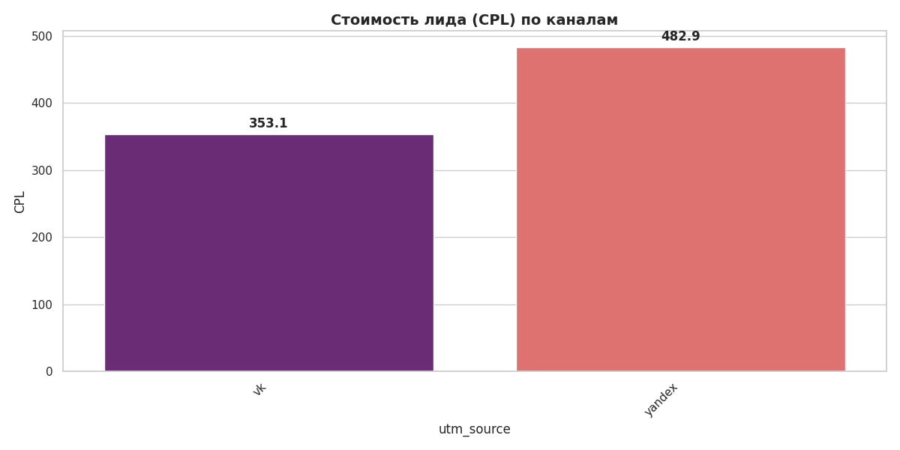

# Marketing ROI & Growth Strategy Analysis (Last Paid Click)

## [EN] Project Overview
Comprehensive marketing audit for an EdTech platform. I implemented a **Last Paid Click (LPC)** attribution model to bridge the gap between ad spends and actual revenue. 

### 📊 Project Assets
* **Presentation:** [Download Full Strategy PDF](presentation/Growth_Audit_Data_Driven_Strategy.pdf)
* **SQL Logic:** Found in `/sql` folder (Core attribution pipelines).
* **Datasets:** Aggregated marketing marts in `/data` folder.
* **Visuals:** High-resolution charts in `/img` folder.

### 🚀 Key Achievements:
* **High-ROI Scaling:** Identified **Yandex Ads** as the primary growth driver with a massive **2278% ROI**.
* **Funnel Efficiency:** Marketing conversion ($CR_1$) is high at 9.4%, but an **88% lead-to-purchase drop-off** was identified as the main revenue bottleneck.
* **Golden Segment:** Data proves that the **40+ age group** generates 60% of total revenue.
* **Sales Audit:** Found that **Top-3 managers generate 70% of cash flow**, suggesting a need for team-wide script optimization.

**Stack:** PostgreSQL, Python (Pandas/Seaborn), Unit Economics.

---

## [RU] Анализ маркетинговой атрибуции и стратегии роста
Сквозной аудит маркетинга EdTech-платформы. Внедрена модель атрибуции **Last Paid Click (LPC)** для связки рекламных расходов с реальной выручкой.

### 📊 Материалы проекта
* **Презентация:** [Скачать стратегию в PDF](presentation/Growth_Audit_Data_Driven_Strategy.pdf)
* **SQL логика:** Папка `/sql` (скрипты атрибуции и витрин).
* **Данные:** Агрегированные таблицы в папке `/data`.
* **Визуализация:** Все графики и инсайты в папке `/img`.

### 🚀 Ключевые результаты:
* **ROI-лидеры:** Выявлено, что **Yandex Ads** — главный драйвер роста с **ROI 2278%**.
* **Эффективность воронки:** При высокой конверсии маркетинга (9.4%), обнаружена потеря **88% лидов** на этапе продаж — это главный рычаг роста прибыли.
* **«Золотой сегмент»:** Анализ подтвердил, что **аудитория 40+** приносит 60% всей выручки.
* **Аудит продаж:** Топ-3 менеджера делают **70% кассы**, что требует масштабирования их практик на весь отдел.

**Стек:** PostgreSQL, Python (Pandas/Seaborn), Юнит-экономика.

---

### Visual Insights
#### Marketing Performance & ROI

#### Channel Efficiency (CPL & Telegram)

#### Sales Funnel & Demographics

#### Commercial Audit

