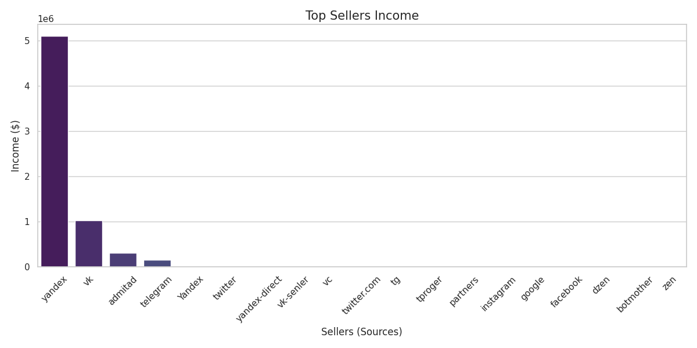
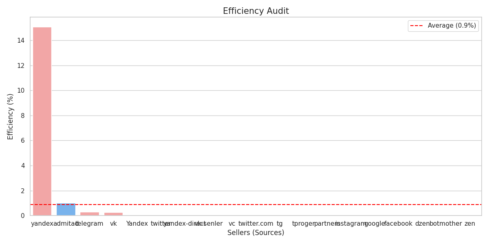
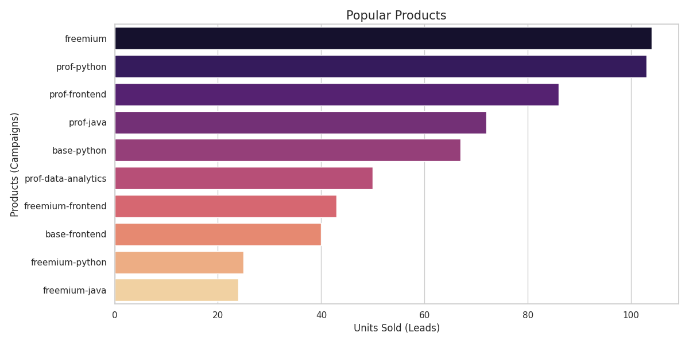
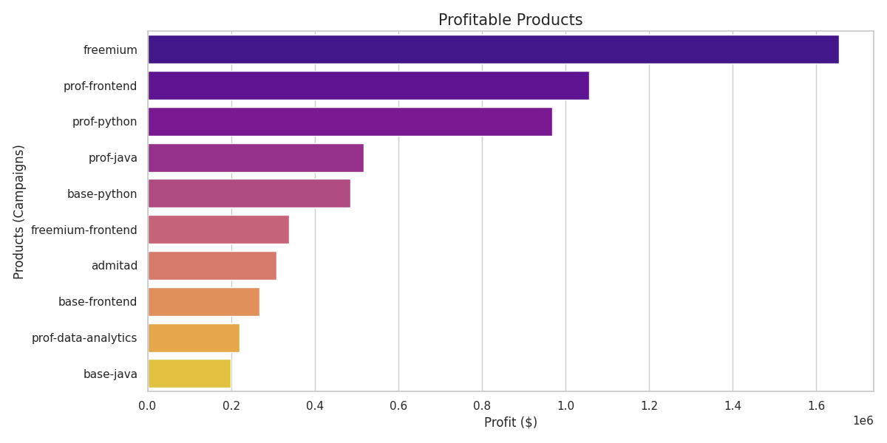
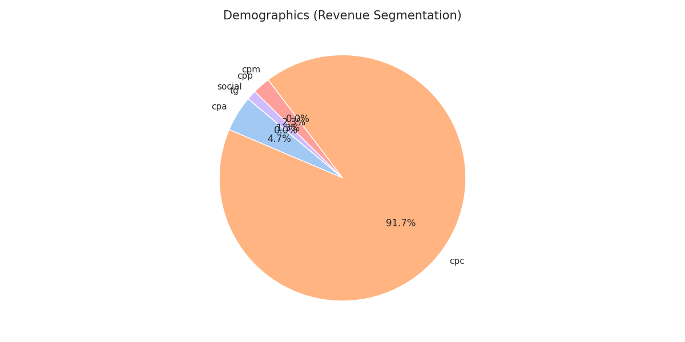
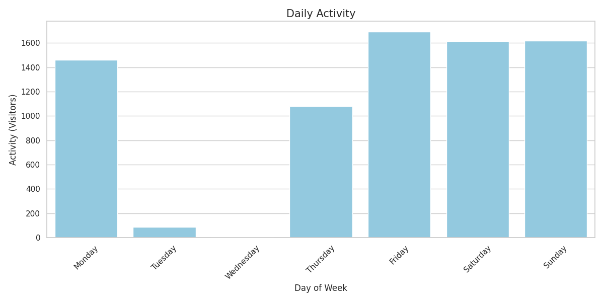

# 📊 Маркетинговый аудит онлайн-школы (LPC модель)

## 💼 Моя экспертиза
Маркетинговый стратег с 16-летним опытом управления крупными бюджетами. Мой бэкграунд в проектах масштаба **Олимпийских игр в Сочи** и **Универсиады в Казани** позволяет мне находить точки роста там, где их не видит стандартная CRM. Я превращаю сухие цифры в понятную дорожную карту для бизнеса.

## 🛠 Стек технологий
* **SQL (PostgreSQL):** Сверхточная обработка данных и реализация сложной бизнес-логики аудита.
* **Python (Pandas, Matplotlib, Seaborn, NumPy):** Обработка данных и создание профессиональной визуализации для C-level менеджмента.

---

## 📁 Структура репозитория
* **/presentation/** — полная презентация проекта в PDF.
* **/sql/** — скрипты аудита.
* **/data/** — обработанные датасеты (CSV).
* **/images/** — визуализация инсайтов.
* **visualize_retail.py** — движок генерации графиков.
* **requirements.txt** — необходимые библиотеки Python.

---

📄 **[Скачать финальную презентацию проекта (PDF)](./presentation/Презентация_Маркетинговый_Аудит.pdf)**

---

## 📈 Ключевые инсайты исследования

### 1. ROI и эффективность каналов

*Яндекс — лидер с ROI 2221%. VK требует оптимизации (ROI 1125%).*

### 2. Конверсия и качество трафика

*Анализ выявил 15% конверсию в Яндексе против 0.26% в VK, что требует смены стратегии для соцсетей.*

### 3. Анализ продуктов и выручки

*Лид-магниты (Freemium) — основной драйвер воронки.*

### 4. Риски: Зависимость от платной рекламы

*91.7% выручки зависит от CPC. Необходима срочная диверсификация в органику и Telegram.*

### 5. Поведенческие тренды

*Пик визитов в выходные при нулевых продазах — точка роста для отдела продаж.*

---

## 💡 Резюме стратегии кратко
1. **Масштабирование:** Увеличение бюджета на Яндекс.
2. **Оптимизация VK:** Внедрение трипвайеров и дожимных рассылок.
3. **Безопасность:** Развитие Telegram для снижения зависимости от Яндекса.
4. **Продажи:** Аудит скриптов и изменение графика работы менеджеров.
