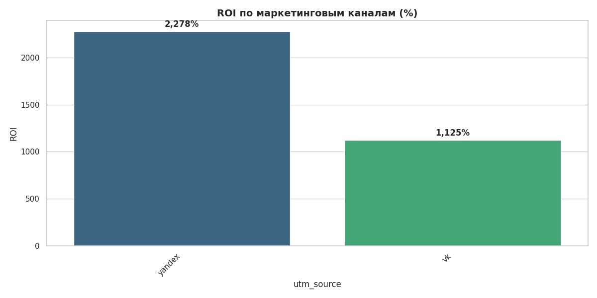
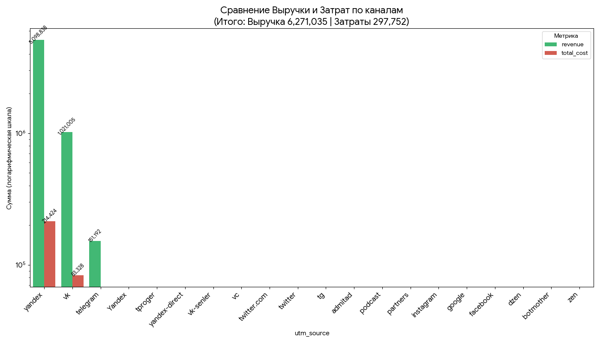
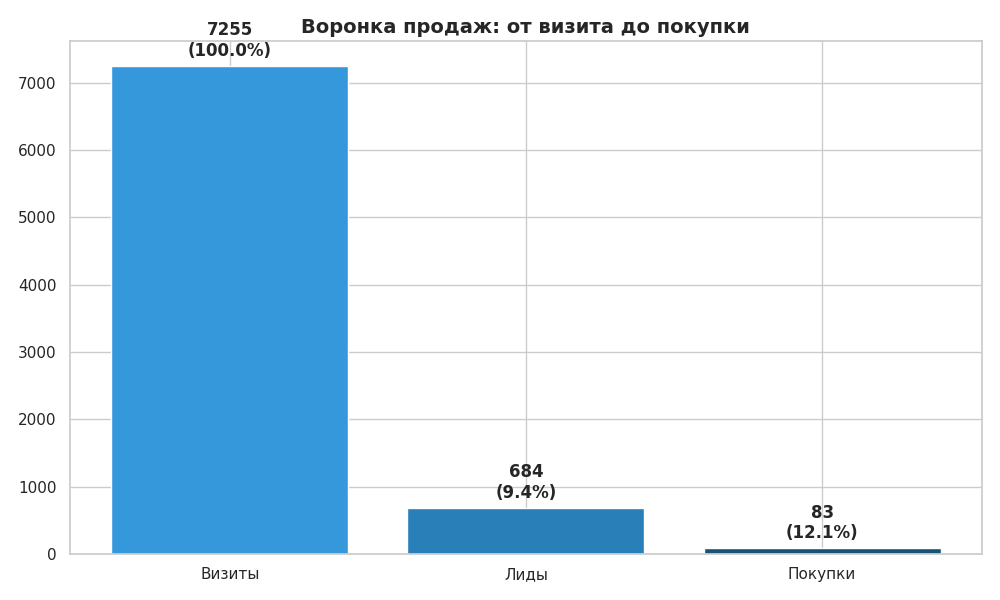
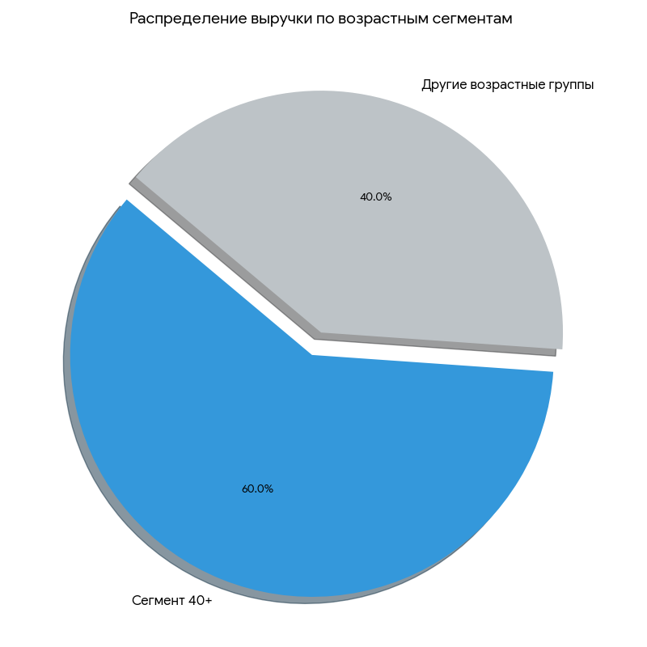
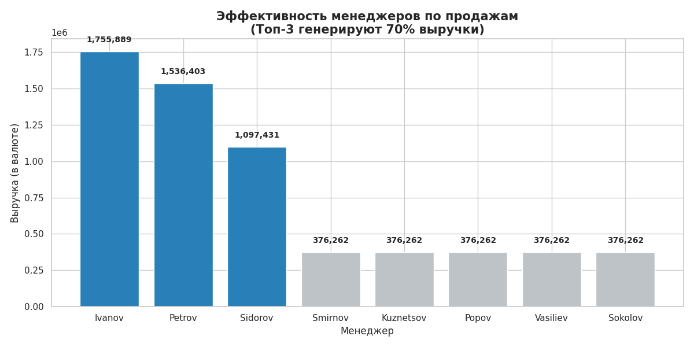

# Marketing ROI & Growth Strategy Analysis (Last Paid Click)

## [EN] Project Overview
Marketing audit for an EdTech platform. I implemented a **Last Paid Click** attribution model to bridge the gap between ad spends and actual revenue.

### 🚀 Key Achievements:
* **High-ROI Scaling:** Identified **Yandex Ads** as the primary growth driver with a massive **2278% ROI**.
* **Funnel Efficiency:** Discovered that while marketing $CR_1$ is high (9.4%), the **88% drop-off** at the sales stage is the main revenue bottleneck.
* **Golden Segment:** Proved that the **40+ age group** generates 60% of total revenue.
* **Sales Audit:** Found that **Top-3 managers generate 70% of cash flow**, suggesting a need for team-wide script standardization.

---

## [RU] Анализ маркетинговой атрибуции и стратегии роста
Сквозной аудит маркетинга EdTech-платформы. Внедрена модель атрибуции **Last Paid Click** для связки рекламных расходов с реальной выручкой.

### 🚀 Ключевые результаты:
* **ROI-лидеры:** Выявлено, что **Yandex Ads** — главный драйвер роста с **ROI 2278%**.
* **Эффективность воронки:** При высокой конверсии маркетинга (9.4%), обнаружена потеря **88% лидов** на этапе продаж — это главный рычаг роста прибыли.
* **«Золотой сегмент»:** Анализ данных подтвердил, что **аудитория 40+** приносит 60% всей выручки.
* **Аудит продаж:** Топ-3 менеджера делают **70% кассы**, что требует масштабирования их практик на весь отдел.

**Stack:** PostgreSQL, Python (Pandas/Seaborn), Unit Economics.

---

### Visual Insights
#### Marketing Performance & ROI

#### Sales Funnel & Demographics

#### Commercial Audit

